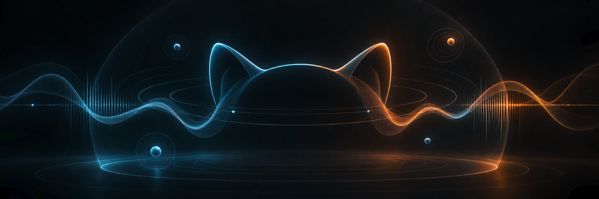

# NekoSpace Audio

[](https://github.com/moe-charm/nekospace-audio/actions/workflows/ci.yml)
[](https://github.com/moe-charm/nekospace-audio/releases/tag/v0.2.0-alpha)


[](LICENSE)

音声作品・ASMR・ボイス制作のための、オープンソース空間音響・音声修復ツールにゃ。

English: [README.md](README.md)

### [⬇ NekoSpace Binaural v0.2.0-alpha — Windows x64版をダウンロード](https://github.com/moe-charm/nekospace-audio/releases/download/v0.2.0-alpha/NekoSpaceBinaural-v0.2.0-alpha-Windows-x64.zip)

VST3エフェクトとDAW不要のStandalone入り。ヘッドフォン／イヤホン推奨にゃ。
[74秒の操作デモを見る](https://youtu.be/nk54N0w6FOE) ·
[製品ガイドを読む](plugins/binaural/README.md)

## 音声制作の流れ

| 1 — 整える | 2 — 配置する | 3 — 部屋を与える |
| --- | --- | --- |
| **CleanVoice**が声のない区間からノイズを学び、ステレオ像を崩さず整えるにゃ。 | **Binaural**が声や効果音を聴き手の周囲や耳元へ配置するにゃ。 | **Reverb**が元の定位を尊重しながら、初期反射と自然な残響を加えるにゃ。 |

現在、パッケージ公開済みなのはBinauralにゃ。CleanVoiceとReverbはソースからビルドする
開発中製品にゃ。

## 主力製品 — NekoSpace Binaural

[](plugins/binaural/README.md)

- 声向けの左右・前後・距離と、強い耳元配置にゃ。
- Natural／Enhanced HRTF、方向付きRoom Assist、ファクトリーシーンプリセットにゃ。
- 現行ソースではVST3、Standalone、ファイルPlayerが同じProcessorとEditorを共有するにゃ。

**[Windows版をダウンロード](https://github.com/moe-charm/nekospace-audio/releases/download/v0.2.0-alpha/NekoSpaceBinaural-v0.2.0-alpha-Windows-x64.zip)** ·
[デモ](https://youtu.be/nk54N0w6FOE) · [詳細と限界](plugins/binaural/README.md)

## 開発中

<table>
  <tr>
    <th width="50%"><a href="plugins/reverb/README.md">NekoSpace Reverb</a></th>
    <th width="50%"><a href="plugins/cleanvoice/README.md">NekoSpace CleanVoice</a></th>
  </tr>
  <tr>
    <td><a href="plugins/reverb/README.md"></a></td>
    <td><a href="plugins/cleanvoice/README.md"></a></td>
  </tr>
  <tr>
    <td><strong>開発中 — DSPとUIは動作中。</strong><br>6つの初期反射、決定論的16-lineテール、6つの初期プリセット。VST3、Standalone、ファイルPlayerが本物のProcessorを共有するにゃ。<br><a href="https://youtu.be/lT10UuXTyAE">101秒の機能紹介を見る</a>にゃ。</td>
    <td><strong>プロトタイプ — オフラインアプリとCLI。</strong><br>声のない区間を学習し、Original／Clean／Removedを比較してからファイル全体を処理するにゃ。</td>
  </tr>
</table>

公開済みの[Reverb機能紹介](https://youtu.be/lT10UuXTyAE)は
[`video/`](video/README.md)から再現できるにゃ。CleanVoiceのデモは、
公開可能なノイズ入り声素材が決まってから制作するにゃ。仕事用録音、生成ナレーション、完成動画は
Gitへ入れないにゃ。

## 正直な開発状況

- **Binaural:** 水平方向と耳元表現が強みにゃ。上下は演出上の色として使えるけど、
  非個人化された静的HRTFで確実な上下判定を保証はしないにゃ。
- **Reverb:** オーナー試聴で自然な方向として採用し、FL StudioでVST3の音声処理も確認済みにゃ。
  CPU／メモリ証拠、配布パッケージ、残りのリリースゲートは未完にゃ。
- **CleanVoice:** 固定プロファイルと左右共通ゲインによるオフライン処理は動作中。
  リアルタイムプラグインではまだないにゃ。

測定値、限界、検証境界は美化せず、各製品READMEへ残しているにゃ。

## インストール

現在公開しているWindows版はNekoSpace Binauralにゃ。
[Releases](https://github.com/moe-charm/nekospace-audio/releases)からzipを展開し、
`NekoSpace Binaural.vst3`をフォルダーごと次へコピーするにゃ。

```text
C:\Program Files\Common Files\VST3\
```

DAWで再スキャンするにゃ。FL Studioなら *Options → Manage plugins → Find more plugins*。
`NekoSpace Binaural.exe`はDAWなしで動くにゃ。バイノーラル再生にはヘッドフォンが必要にゃ。

ReverbとCleanVoiceは、それぞれの配布ゲートとパッケージが完成するまでソースからの開発版にゃ。

## ビルド

CMake 3.22以上、C++17コンパイラ（WindowsならVisual Studio 2022）、gitが必要にゃ。
JUCEはトップレベルconfigureで一度だけ取得し、全製品で共有するにゃ。

```bash
cmake -B build -G "Visual Studio 17 2022" -A x64
cmake --build build --config Release
ctest --test-dir build -C Release
```

## リポジトリ構成

```text
nekospace-audio/
├─ plugins/
│  ├─ binaural/      DSP、VST3／Standalone、ファイルPlayer、テスト、製品ドキュメント
│  ├─ reverb/        独立DSP、VST3／Standalone、ファイルPlayer、解析基盤
│  └─ cleanvoice/    JUCE非依存DSP／CLI＋JUCEオフライン編集アプリ
├─ shared/           複数製品で実証された製品中立DSP
├─ docs/             スイート共通契約と公開安全な画像
├─ video/            Remotionソース。非公開素材と完成動画は除外
└─ cmake/            ビルド補助
```

配置ルールは[repository layout](docs/repo-layout.md)、トップページの構成契約は
[README structure](docs/readme-structure.md)にゃ。

## 全製品共通の契約

- [Identity](docs/identity.md) — 著作権者、ブランド、変更不可のプラグインコード
- [State format](docs/state-format.md) — 古いDAWプロジェクトを壊さない保存形式
- [Realtime contract](docs/realtime-contract.md) — オーディオスレッド規約
- [Third-party licences](docs/third-party-licenses.md) — 依存ライセンスの正本
- [IEM reference boundary](docs/reference-iem.md) — 何を学び、GPLとどう線引きしたか
- [Denoise research](docs/reference-denoise.md) — 囁き保護と左右共通ゲイン
- [Video production](docs/video-production.md) — 非公開素材境界と再現可能な動画制作

## リリース

`v*`タグをpushすると、リリースworkflowが宣言済みの対象をビルド・テストし、
ライセンス／noticesと一緒に梱包してdraft GitHub Releaseを作るにゃ。
凍結済みIDと履歴は[CHANGELOG.md](CHANGELOG.md)にゃ。

## ライセンス

**GNU Affero General Public License v3.0 or later** のフリーソフトウェアにゃ。
[LICENSE](LICENSE)参照にゃ。

    Copyright (C) 2026 charmpic

**このツールで作った音声は君のものにゃ。** AGPLの対象はソフトウェア自身のソースと
バイナリで、制作した録音やレンダリング音声ではないにゃ（LICENSE第2条）。
