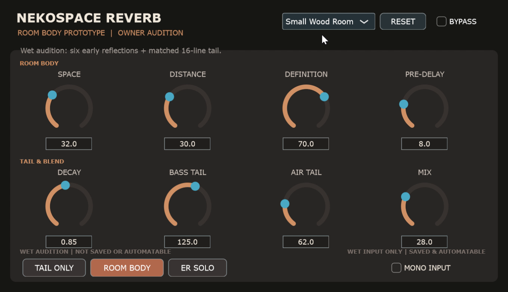
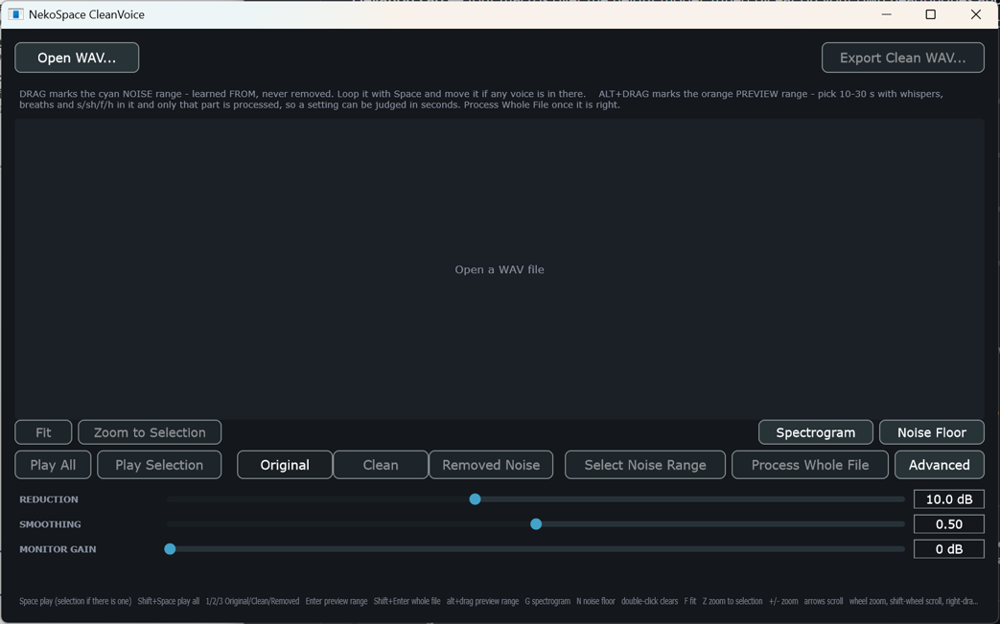

# NekoSpace Audio

English: [README.md](README.md)

音声作品・ASMR・ボイス制作向けのオープンソース音声ツールにゃ。
C++17 / JUCE / CMake、AGPLv3-or-laterにゃ。

| 製品 | 用途 | 状態 |
| --- | --- | --- |
| [**NekoSpace Binaural**](plugins/binaural/README.md) | 声や効果音を聴き手の周囲へ配置 | `v0.2.0-alpha` |
| [**NekoSpace Reverb**](plugins/reverb/README.md) | 元のステレオ像を保ちながら自然な部屋を作る | オーナー試聴版 |
| [**NekoSpace CleanVoice**](plugins/cleanvoice/README.md) | 囁きの定常ノイズを学習して除去 | オフライン試作版 |

<table>
  <tr>
    <th width="33%">NekoSpace Binaural</th>
    <th width="33%">NekoSpace Reverb</th>
    <th width="33%">NekoSpace CleanVoice</th>
  </tr>
  <tr>
    <td></td>
    <td></td>
    <td></td>
  </tr>
  <tr>
    <td>声向けの3D配置と、耳元まで近づける距離表現。</td>
    <td>6つの初期反射、決定論的16-lineテール、6つの初期プリセット。</td>
    <td>ノイズ区間を学習し、Original / Clean / Removedを比較。</td>
  </tr>
</table>

## デモ

- ▶ [NekoSpace Binaural — 74秒の操作デモ](https://youtu.be/nk54N0w6FOE)
  — ヘッドフォン／イヤホン推奨にゃ。
- **NekoSpace Reverb** — ナレーション付き機能紹介はローカルで完成済みにゃ。
  再現用のRemotion／VOICEVOXコードは [`video/`](video/README.md) にあり、公開後に
  YouTubeリンクへ差し替えるにゃ。
- **NekoSpace CleanVoice** — 公開可能なノイズ入り声素材が決まってから制作するにゃ。

録画、生成ナレーション、完成動画はGitから全体除外し、再現用コード・台本・タイミングだけを
追跡するにゃ。

## 現状 — 正直版

### NekoSpace Binaural

Windows VST3とStandaloneで、左右・前後・距離、強い耳元表現が動くにゃ。
上下は音色と軽い移動感を作れるけど、確実な上下判定にはならないにゃ。静的で非個人化された
HRTFは聴き手自身の耳の形を知らず、ヘッドフォンも同じ5〜12 kHzを色づけするためにゃ。
高さは演出を補助する色として使い、物語の必須手がかりにはしないにゃ。測定値と詳しい経緯は
[Binaural README](plugins/binaural/README.md) に分離しているにゃ。

### NekoSpace Reverb

VST3、JUCE Standalone、ファイルPlayerは、本物のProcessorとEditorを共有しているにゃ。
現在のRoom Bodyは6つの一次反射と、採用済みの低着色16-lineテールを組み合わせるにゃ。
初期プリセットは **Default / Voice Booth / Small Wood Room / Dialogue Stage /
Soft Chamber / Open Hall**。値を動かすと`Custom`、ResetでDefaultへ戻るにゃ。

2026-08-28に現在の音を自然な方向としてオーナー試聴で採用し、FL StudioでもVST3の
読み込みと音声処理を確認したにゃ。ただし公開alphaではまだないにゃ。CPU／メモリ証拠、
最終パラメーター凍結、配布パッケージ、残りのvalidatorは明示的な未完ゲートにゃ。

### NekoSpace CleanVoice

オフライン編集アプリとCLIは、声のない区間から固定ノイズプロファイルを学習するにゃ。
同じ範囲を **Original / Clean / Removed Noise** で比較してから全体を処理できるにゃ。
全チャンネルへ同じスペクトルゲインを掛けるので、バイノーラル定位を溶かさない設計にゃ。
リアルタイムプラグインではまだないにゃ。詳しい操作は
[CleanVoice README](plugins/cleanvoice/README.md) にゃ。

## インストール

現在公開しているWindows版はNekoSpace Binauralにゃ。
[Releases](https://github.com/moe-charm/nekospace-audio/releases)からzipを展開し、
`NekoSpace Binaural.vst3`をフォルダーごと次へコピーするにゃ。

```text
C:\Program Files\Common Files\VST3\
```

DAWで再スキャンするにゃ。FL Studioなら *Options → Manage plugins → Find more plugins*。
`NekoSpace Binaural.exe`はDAWなしで動くにゃ。バイノーラル再生にはヘッドフォンが必要にゃ。

ReverbとCleanVoiceは、それぞれの配布ゲートとパッケージが完成するまでソースからの開発版にゃ。

## ビルド

CMake 3.22以上、C++17コンパイラ（WindowsならVisual Studio 2022）、gitが必要にゃ。
JUCEはトップレベルconfigureで一度だけ取得し、全製品で共有するにゃ。

```bash
cmake -B build -G "Visual Studio 17 2022" -A x64
cmake --build build --config Release
ctest --test-dir build -C Release
```

## リポジトリ構成

```text
nekospace-audio/
├─ plugins/
│  ├─ binaural/      DSP、VST3／Standalone、ファイルPlayer、テスト、製品ドキュメント
│  ├─ reverb/        独立DSP、VST3／Standalone、ファイルPlayer、解析基盤
│  └─ cleanvoice/    JUCE非依存DSP／CLI＋JUCEオフライン編集アプリ
├─ shared/           複数製品で実証された製品中立DSP
├─ docs/             スイート共通契約と公開安全な画像
├─ video/            Remotionソース。非公開素材と完成動画は除外
└─ cmake/            ビルド補助
```

配置ルールは[repository layout](docs/repo-layout.md)、トップページの構成契約は
[README structure](docs/readme-structure.md)にゃ。

## 全製品共通の契約

- [Identity](docs/identity.md) — 著作権者、ブランド、変更不可のプラグインコード
- [State format](docs/state-format.md) — 古いDAWプロジェクトを壊さない保存形式
- [Realtime contract](docs/realtime-contract.md) — オーディオスレッド規約
- [Third-party licences](docs/third-party-licenses.md) — 依存ライセンスの正本
- [IEM reference boundary](docs/reference-iem.md) — 何を学び、GPLとどう線引きしたか
- [Denoise research](docs/reference-denoise.md) — 囁き保護と左右共通ゲイン
- [Video production](docs/video-production.md) — 非公開素材境界と再現可能な動画制作

## リリース

`v*`タグをpushすると、リリースworkflowが宣言済みの対象をビルド・テストし、
ライセンス／noticesと一緒に梱包してdraft GitHub Releaseを作るにゃ。
凍結済みIDと履歴は[CHANGELOG.md](CHANGELOG.md)にゃ。

## ライセンス

**GNU Affero General Public License v3.0 or later** のフリーソフトウェアにゃ。
[LICENSE](LICENSE)参照にゃ。

    Copyright (C) 2026 charmpic

**このツールで作った音声は君のものにゃ。** AGPLの対象はソフトウェア自身のソースと
バイナリで、制作した録音やレンダリング音声ではないにゃ（LICENSE第2条）。
