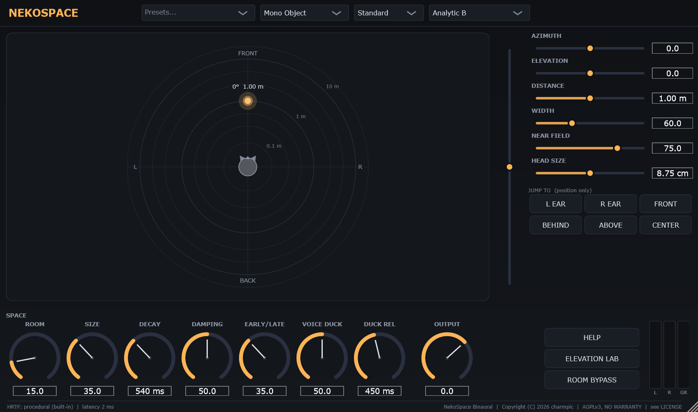
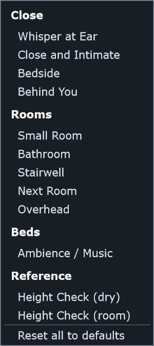
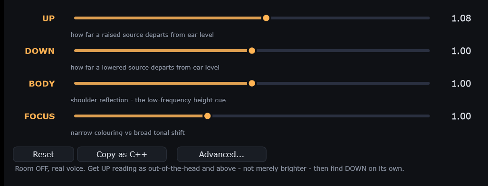
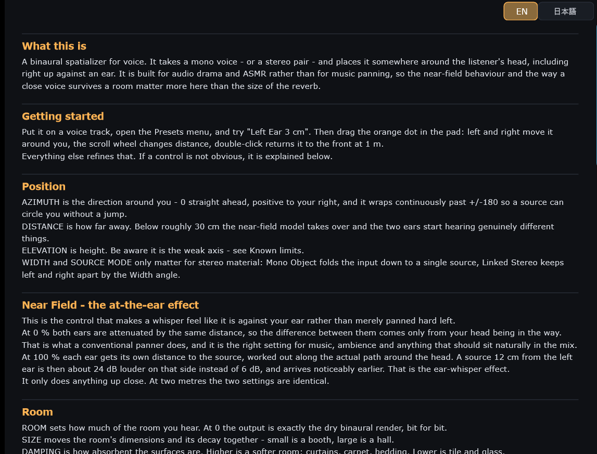
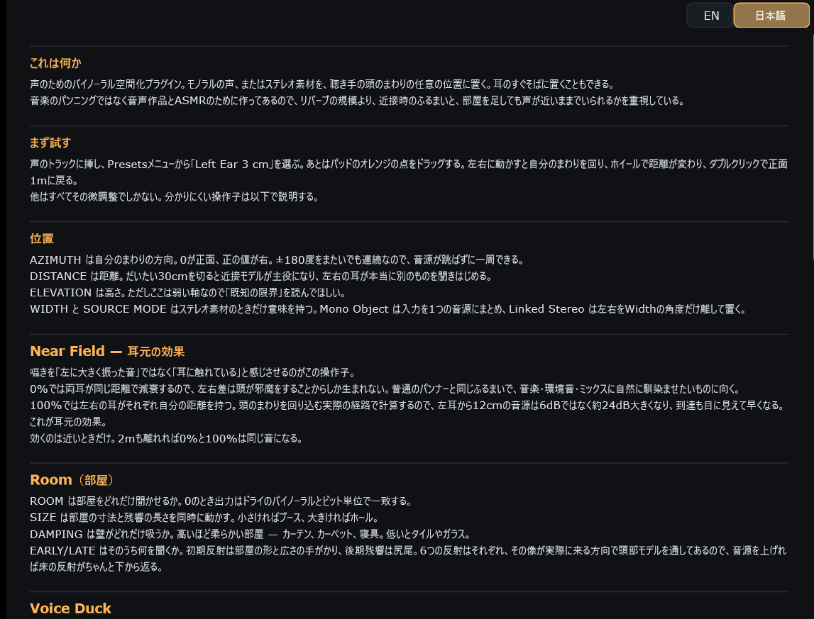

# NekoSpace Audio

English: [README.md](README.md)

音声作品・ボイス制作向けのオーディオプラグインにゃ。C++17 / JUCE / CMake、AGPLv3にゃ。

| 製品 | 状態 | |
| --- | --- | --- |
| **NekoSpace Binaural** | v0.2.0-alpha | 声に特化した3Dバイノーラル空間化 — [readme](plugins/binaural/README.md) |
| **NekoSpace CleanVoice** | 試作 | 囁き向けノイズ除去、アプリ + CLI — [readme](plugins/cleanvoice/README.md) |
| **NekoSpace Reverb** | Room Body v2 試聴可能 | 採用済み16-lineテール＋音量整合した一次反射試聴＋Wet専用Mono Input、オーナー試聴待ち — [設計](plugins/reverb/README.md) |
| NekoSpace Room | 予定 | |
| NekoSpace Delay | 予定 | |



▶ **[74秒のNekoSpace BinauralデモをYouTubeで見る](https://youtu.be/nk54N0w6FOE)**
— ヘッドフォン／イヤホン推奨にゃ。

## 現状 — 正直版

alphaにゃ。パラメーターID・プラグインコード・選択肢リストは `v0.1.0-alpha` で凍結して、
それ以降変えていないにゃ（[CHANGELOG.md](CHANGELOG.md) 参照）。音のほうはまだ固まってないにゃ。

**NekoSpace Binaural は動くにゃ。** 左右・前後・距離、そして耳元の「耳のすぐそば」表現は
どれも宣伝どおりに機能するにゃ。JUCE非依存の受け入れテスト33本と
`pluginval --strictness-level 10` で検証済みにゃ。

**弱いのは上下にゃ。** 音は確かに変わるし、多少の上下動は感じられるけど、
「上にいる」と確信できる手がかりにはなってないにゃ。これは見つけられてないバグではなく、
**静的・非個人化バイノーラルの原理的な限界**にゃ。高さを運ぶスペクトル手がかりは
**聴く人自身の耳たぶの形**に依存するし、ヘッドフォンはまさにその 5〜12 kHz を色づけするにゃ。

4つの手を試して計測したにゃ — 数式モデルの再設計、KU100の実測データ、
胴体反射＋初期反射のHRTFレンダリング、そして聴く人ごとの手動調整にゃ。
**どれも数値は改善したけど、どれも決定的な知覚は生まなかった**にゃ。
上下は「演出の色付け」として使い、物語の要には据えないのが正解にゃ。

## CleanVoice 試作版

**NekoSpace CleanVoice** は、囁きや息の多い声向けのオフライン編集アプリ＋CLIにゃ。
リアルタイムプラグインではまだないにゃ。声のないノイズ区間を選んで固定プロファイルを学習し、
同じプレビュー範囲を **Original / Clean / Removed Noise** で聴き比べてから全体を処理するにゃ。
全チャンネルへ同じスペクトルゲインを掛けるので、ノイズ除去でバイノーラル定位を溶かさない設計にゃ。
使い方と現時点の制限は [CleanVoice readme](plugins/cleanvoice/README.md) にまとまってるにゃ。

## もう少し詳しく

| | |
| --- | --- |
| **プリセットは「場面」まるごと**にゃ。音を決めるパラメーターを全部設定するので、同じ名前なら必ず同じ音になるにゃ。メイン画面の JUMP TO ボタンは逆の仕事で、**位置だけ動かして作り込んだ部屋には触らない**にゃ。 |  |

**Elevation Lab** — 高さモデルを4つのマクロで操作して、自分のヘッドフォンで耳で合わせて
固めるためのものにゃ。`Advanced…` で背後の24個の生の値が出て、`Copy as C++` で
そのカーブを恒久化するコードブロックが取れるにゃ。



**マニュアルはプラグインの中**にゃ。英語と日本語があって、ウィンドウの中で切り替えるにゃ。
初回はOSの言語に従い、選択は**プロジェクトではなくユーザーごとに**保存されるので、
昔のセッションを開いても言語が戻ることはないにゃ。





## インストール

[Releases](https://github.com/moe-charm/nekospace-audio/releases) からWindows用zipを
落として展開するにゃ。`.vst3` フォルダ、スタンドアロンの `.exe`、ライセンスと表示物が
入ってるにゃ。

1. **`NekoSpace Binaural.vst3` フォルダごと**（1個のファイルじゃなくてバンドルにゃ）
   `C:\Program Files\Common Files\VST3\` にコピーするにゃ。
2. DAWでプラグインを再スキャンするにゃ。FL Studioなら
   *Options → Manage plugins → Find more plugins* にゃ。
3. DAWなしで音を聴くだけなら `NekoSpace Binaural.exe` がそのまま動くにゃ。

**ヘッドフォン必須**にゃ。バイノーラルなので、スピーカーだと効果は成立しないにゃ。

昔の名前で入れたことがあってDAWがロードを拒む場合は、DAWが古いプラグインIDを
キャッシュしてるにゃ。プラグインデータベースを消して再スキャンするにゃ。

## ビルド

CMake 3.22以上、C++17コンパイラ（WindowsならVisual Studio 2022）、gitが必要にゃ。
JUCEは初回configure時に自動取得されるにゃ。

```bash
cmake -B build -G "Visual Studio 17 2022" -A x64
cmake --build build --config Release
ctest --test-dir build -C Release
```

全製品がトップレベルのconfigure 1回でビルドされて、JUCEは1度だけ取得して共有されるにゃ。

## 構成

```
nekospace-audio/
├─ plugins/          製品ごとに1ディレクトリ、自己完結
│  ├─ binaural/      src, tests, docs, tools, resources
│  ├─ cleanvoice/    JUCE非依存DSP/CLI＋JUCEスタンドアロンGUI
│  └─ reverb/        設計契約＋JUCE非依存のPhase 0解析基盤
├─ shared/           複数プラグインが実際に必要としたコードだけ
├─ docs/             製品横断の契約
├─ video/            Remotionソース、非公開素材と完成動画は除外
└─ cmake/            ビルド補助
```

何をどこに置くか、特に **なぜ `shared/` を空で始めるのか** は
[docs/repo-layout.md](docs/repo-layout.md) にゃ。

## 全製品に共通のドキュメント

- [identity.md](docs/identity.md) — 著作権者とブランドの区別、リリース後は変更不可のVST3/AUコード
- [state-format.md](docs/state-format.md) — ホストのプロジェクトに何を保存するか、古いプロジェクトを読み続けるためのルール
- [realtime-contract.md](docs/realtime-contract.md) — スレッド規約
- [third-party-licenses.md](docs/third-party-licenses.md) — 依存ライセンスのSSOT
- [reference-iem.md](docs/reference-iem.md) — IEM Plug-in Suite から何を学び、何を採らないか、GPLとの線引き
- [reference-denoise.md](docs/reference-denoise.md) — 囁き・息のノイズ除去。調波前提の手法が使えない理由と、バイノーラル素材に左右共通ゲインが要る理由

## ライセンス

**GNU Affero General Public License v3.0 or later** のフリーソフトウェアにゃ
（[LICENSE](LICENSE) 参照）。

    Copyright (C) 2026 charmpic

**このプラグインで作った音声は君のものにゃ。** AGPLが対象にするのはプラグイン自身の
ソースとバイナリにゃ。レンダリングされた音声はソフトウェアの派生物ではないにゃ
（LICENSE 第2条参照）。NekoSpaceで制作した録音や音声作品にAGPLの義務は一切かからないにゃ。
